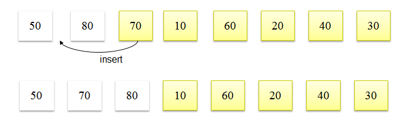
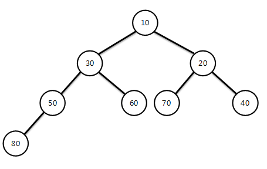

# 03. 정렬 알고리즘

## 평균 수행 시간이 O(n^2)인 알고리즘

- 버블 정렬(Bubble Sort), 삽입 정렬(Insertion Sort), 선택 정렬(Selection Sort)

- 각 요소가 다른 요소와 평균 한번 이상씩 비교를 하여 정렬 됨

### Insertion Sort 구현해보기

- Insertion Sort의 기본 개념은 이미 정렬된 상태의 요소에 새로운 요소를 추가할 때 정렬하여 추가하는 개념이다.(손안의 카드)

- 두 번째 요소 부터 이전 요소들과 비교하면서 insert 될 위치를 찾아가며 정렬하는 알고리즘



```
public class InsertionSort {

	public static void insertionSort(int[] arr, int count) {
		
		int i = 0, j = 0;
		int temp = 0;

		for(i = 1; i < count; i++) {
			temp = arr[i];
			j = i;
			while((j > 0) && arr[j-1] > temp) {
				arr[j] = arr[j-1];
				j = j - 1;
			}
			arr[j] = temp;

			System.out.println("반복 -" + i);
			printSort(arr, count);
		}
		
	}
	
	public static void printSort(int value[], int count)
	{
		int i = 0;
		for(i = 0; i < count; i++) {
			System.out.print(value[i] + "\t");
		}
		System.out.println();
	}
	
	public static void main(String[] args) {
		
		int[] arr = {80, 50, 70, 10, 60, 20, 40, 30 };
		
		insertionSort(arr, 8);
	}

}
```


## 평균 수행 시간이 O(logN)인 알고리즘

- 퀵 정렬(Quick Sort), 병합 정렬(Merge Sort), 힙 정렬(Heap Sort)

- 한번 수행될 때마다 정렬되어야 하는 수의 범위가 1/2로 줄어드는 경우

- 퀵 정렬 이외의 다른 알고리즘은 추가적인 메모리가 필요함

### Heap Sort 구현해보기



```
public class HeapSort {

	private int SIZE;
	private int heapArr[];
	
	public HeapSort()
	{
		SIZE = 0;
		heapArr = new int [50];
	}
	
	public void insertHeap(int input)
	{
		int i = ++SIZE;
		//while(( i != 1) && ( input > heapArr[i/2])){ //max heap
		while(( i != 1) && ( input < heapArr[i/2])){ //min heap
			heapArr[i] = heapArr[i/2];
			i = i/2;
		}
		heapArr[i] = input;
	}
	
	public int getHeapSize()
	{
		return SIZE;
	}
	
	public int deleteHeap()
	{
		int parent, child;
		int data, temp;
		data = heapArr[1]; 
		
		temp = heapArr[SIZE]; 
		SIZE -= 1; 
		parent =1; child = 2;
		
		while(child <= SIZE){
			//if((child < HEAP_SIZE) && (heapArr[child] < heapArr[child+1])){ //max heap
			if((child < SIZE) && (heapArr[child] > heapArr[child+1])){ //min heap
				child++;
			}
			//if(temp >= heapArr[child]) break; //max heap
			if(temp <= heapArr[child]) break;   //min heap
			heapArr[parent] = heapArr[child];
			parent = child;
			child *= 2;
		}
		
		heapArr[parent] = temp;
		return data;
	}
	
	public void printHeap(){
		//System.out.printf("\n Max Heap : ");
		System.out.printf("\n Min Heap : ");
		for(int i=1; i<=SIZE; i++)
			System.out.printf("[%d] ", heapArr[i]);
	}
	public static void main(String[] args) {
		HeapSort h = new HeapSort();
		h.insertHeap(80);
		h.insertHeap(50);
		h.insertHeap(70);
		h.insertHeap(10);
		h.insertHeap(60);
		h.insertHeap(20);
		
		h.printHeap();
	
		int n, data;
		n = h.getHeapSize();
		for(int i=1; i<=n; i++){    
			data = h.deleteHeap();  
			System.out.printf("\n 출력 : [%d]", data);
		}
	}
}
```
## 퀵 정렬
### pivot이 왼쪽에 있는 경우

~~~java
public class QuickSort {
	
	public static void sort(int[] a) {
		l_pivot_sort(a, 0, a.length - 1);
	}
	
	/**
	 *  왼쪽 피벗 선택 방식
	 * @param a		정렬할 배열
	 * @param lo	현재 부분배열의 왼쪽
	 * @param hi	현재 부분배열의 오른쪽
	 */
	private static void l_pivot_sort(int[] a, int lo, int hi) {
		
		/*
		 *  lo가 hi보다 크거나 같다면 정렬 할 원소가 
		 *  1개 이하이므로 정렬하지 않고 return한다.
		 */
		if(lo >= hi) {
			return;
		}
		
		/*
		 * 피벗을 기준으로 요소들이 왼쪽과 오른쪽으로 약하게 정렬 된 상태로
		 * 만들어 준 뒤, 최종적으로 pivot의 위치를 얻는다.
		 * 
		 * 그리고나서 해당 피벗을 기준으로 왼쪽 부분리스트와 오른쪽 부분리스트로 나누어
		 * 분할 정복을 해준다.
		 * 
		 * [과정]
		 * 
		 * Partitioning:
		 *
		 *   a[left]          left part              right part
		 * +---------------------------------------------------------+
		 * |  pivot  |    element <= pivot    |    element > pivot   |
		 * +---------------------------------------------------------+
		 *    
		 *    
		 *  result After Partitioning:
		 *  
		 *         left part          a[lo]          right part
		 * +---------------------------------------------------------+
		 * |   element <= pivot    |  pivot  |    element > pivot    |
		 * +---------------------------------------------------------+
		 *       
		 *       
		 *  result : pivot = lo     
		 *       
		 *
		 *  Recursion:
		 *  
		 * l_pivot_sort(a, lo, pivot - 1)     l_pivot_sort(a, pivot + 1, hi)
		 *  
		 *         left part                           right part
		 * +-----------------------+             +-----------------------+
		 * |   element <= pivot    |    pivot    |    element > pivot    |
		 * +-----------------------+             +-----------------------+
		 * lo                pivot - 1        pivot + 1                 hi
		 * 
		 */
		int pivot = partition(a, lo, hi);	
		
		l_pivot_sort(a, lo, pivot - 1);
		l_pivot_sort(a, pivot + 1, hi);
	}
	
	
	
	/**
	 * pivot을 기준으로 파티션을 나누기 위한 약한 정렬 메소드
	 * 
	 * @param a		정렬 할 배열 
	 * @param left	현재 배열의 가장 왼쪽 부분
	 * @param right	현재 배열의 가장 오른쪽 부분
	 * @return		최종적으로 위치한 피벗의 위치(lo)를 반환
	 */
	private static int partition(int[] a, int left, int right) {
		
		int lo = left;
		int hi = right;
		int pivot = a[left];		// 부분리스트의 왼쪽 요소를 피벗으로 설정
		
		// lo가 hi보다 작을 때 까지만 반복한다.
		while(lo < hi) {
			
			/*
			 * hi가 lo보다 크면서, hi의 요소가 pivot보다 작거나 같은 원소를
			 * 찾을 떄 까지 hi를 감소시킨다.
			 */
			while(a[hi] > pivot && lo < hi) {
				hi--;
			}
			
			/*
			 * hi가 lo보다 크면서, lo의 요소가 pivot보다 큰 원소를
			 * 찾을 떄 까지 lo를 증가시킨다.
			 */
			while(a[lo] <= pivot && lo < hi) {
				lo++;
			}
			
			// 교환 될 두 요소를 찾았으면 두 요소를 바꾼다.
			swap(a, lo, hi);
		}
		
		
		/*
		 *  마지막으로 맨 처음 pivot으로 설정했던 위치(a[left])의 원소와 
		 *  lo가 가리키는 원소를 바꾼다.
		 */
		swap(a, left, lo);
		
		// 두 요소가 교환되었다면 피벗이었던 요소는 lo에 위치하므로 lo를 반환한다.
		return lo;
	}
 
	private static void swap(int[] a, int i, int j) {
		int temp = a[i];
		a[i] = a[j];
		a[j] = temp;
	}
}
~~~


* 복잡하다 하지만 정렬 중에서도 아주 빠른 편의 정렬이다
* 중간 피봇을 잡는 경우에는 더 생각할 것이 많다. 이건 추후에..
* 재귀적으로 분할 정복을 왼쪽 부분리스트와 오른쪽 부분리스트를 나누어서 하게된다.
