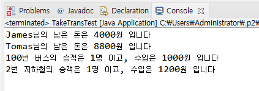

# 객체 간의 협력 (collabration)

## 객체 지향 프로그래밍에서의 협력

- 객체 지향 프로그램에서 객체 간에는 협력이 이루어짐

- 협력을 위해서는 필요한 메세지를 전송하고 이를 처리하는 기능이 구현되어야 함

- 매개 변수로 객체가 전달되는 경우가 발생

- 객체 협력의 예


## 버스와 지하철을 타는 예제 프로그래밍

    James와 Tomas는 각각 버스와 지하철을 타고 학교에 갑니다.
    James는 5000원을 가지고 있었고, 100번 버스를 타면서 1000원을 지불합니다.
    Tomas는 10000원을 가지고 있었고, 초록색 지하철을 타면서 1200원을 지불합니다.

    두 학생이 버스와 지하철을 타는 상황을 구현해 봅시다.
Student.java
```
public class Student {
	
	String studentName;
	int grade;
	int money;
	
	public Student(String studentName, int money) {
		this.studentName = studentName;
		this.money = money;
	}
	
	public void takeBus(Bus bus) {
		bus.take(1000);
		this.money -= 1000;
	}
	
	public void takeSubway(Subway subway) {
		subway.take(1200);
		this.money -= 1200;
	}
		
	public void showInfo() {
		System.out.println(studentName +"님의 남은 돈은 " + money + "원 입니다");
	}
}
```
Bus.java
```
public class Bus {
	
	int busNumber;
	int passengerCount;
	int money;
	
	public Bus(int busNumber) {
		this.busNumber = busNumber;
	}
	
	public void take(int money) {  //승차
		this.money += money;
		passengerCount++;
	}
	
	public void showBusInfo() {
		System.out.println(busNumber + "번 버스의 승객은 " + passengerCount + "명 이고, 수입은 " + money + "원 입니다");
	}
}
```

Subway.java
```
public class Subway {

	int lineNumber;
	int passengerCount;
	int money;
	
	public Subway(int lineNumber) {
		this.lineNumber = lineNumber;
	}
	
	public void take(int money) {
		this.money += money;
		passengerCount++;
	}
	
	public void showSubwayInfo() {
		System.out.println(lineNumber + "번 지하철의 승객은 " + passengerCount + "명 이고, 수입은 " + money + "원 입니다");
	}
}
```

TakeTransTest.java
```
public class TakeTransTest {

	public static void main(String[] args) {
		Student studentJ = new Student("James", 5000);
		Student studentT = new Student("Tomas", 10000);
		
		Bus bus100 = new Bus(100);
		
		Subway subwayGreen = new Subway(2);
		
		
		studentJ.takeBus(bus100);
		studentT.takeSubway(subwayGreen);
		
		studentJ.showInfo();
		studentT.showInfo();
		
		bus100.showBusInfo();
				
		subwayGreen.showSubwayInfo();
	}

}
```

