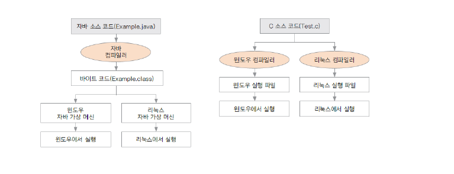

# OOP (Object Oriented Programming)
##  프로그래밍 이란?
* 프로그래밍: 컴퓨터가 일을 수행 하도록 프로그래밍 언어로 명령어 집합(프로그램)을 만드는 일

* 컴파일 : 프로그래밍 언어를 컴퓨터가 실행 가는한 기계어로 만드는 일

* 컴파일러 : 기계어로 바꾸어 주는 프로그램
  ( ex. 자바 컴파일러, gcc )

## 자바 프로그래밍
+ 자바의 역사 : 1991년 제임스 고슬링을 비롯한 선 마이크로 시스템스 연구원들이 처음 개발
  가전, 휴대용 장치에 사용되는 소프트웨어 언어로 개발됨. 안정성이 중요

+ 자바 프로그래밍의 특징
    * 플랫폼에 영향을 받지 않으므로 다양한 환경에서 사용할 수 있다.
      

* 객체 지향 언어이기 때문에 유지보수가 쉽고 확장성이 좋다.

* 프로그램이 안정적이다.

* 풍부한 기능이 제공되는 오픈 소스이다.

## 객체 지향 프로그래밍이 무엇인가?

+ 프로그램의 구현을 시간의 흐름순이 아닌 객체간의 관계와 협력을 기반으로 프로그램 하는 것

+ Object oriented programming(OOP)  이라고 함 ( cf. 절차 지향 프로그래밍 proedural programming )

+ 사용 하는 언어 : Java, C++, C#, Python, JavaScript, Ruby 등 다수

## 자바로 프로그래밍을 하면 좋은 이유 (객체 지향 프로그래밍의 장점)
* 재사용성
* 유지보수
* 코드 관리
* 신뢰성 높은 프로그램

## 자바를 활용한 프로그래밍
* 웹 서버 구현

* 안드로이드 프로그래밍

* 게임 프로그래밍

## 용어 정리

    JDK(Java Development Kit) : 자바에서 제공되는 개발용 라이브러리. 계속 버젼이 올라가고 있음
    JRE(Java Runtime Environment) : 자바 프로그램이 실행되는 환경. 8.0까지 무료로 제공 됨
    JVM(Java Virtual Machine) : 자바 가상 머신으로 프로그램이 실행되는 환경인 JRE 가 설치되어 있어야 함

#클래스와 객체
## 클래스와 객체의 정의와 용도
## 객체와 인스턴스
## 객체의 구성요소 - 속성과 기능
## 인스턴스의 생성과 사용
## 객체 배열
## 클래스의 또 다른 정의
# 변수와 메서드
## 선언 위치에 따른 변수의 종류 클래스 변수와 인스턴스 변수
## 메서드
## 메서드의 선언과 구현
## 메서드 호출
## return문
## JVM의 메모리 구조
## 기보현 매개변수와 참조형 매개변수
## 참조형 반환타입
## 재귀호출
## 클래스 메서드 (static메서드)와 인스턴스 메서드
## 클래스 멤버와 인스턴스 멤버간의 참조와 호출
