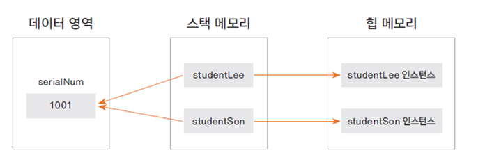
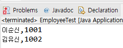
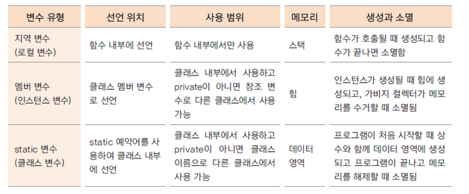

# 여러 인스턴스에서 고통으로 사용하는 변수를 선언하자 - static 변수

## 공통으로 사용하는 변수가 필요한 경우

- 여러 인스턴스가 공유하는 기준 값이 필요한 경우

- 학생마다 새로운 학번 생성

- 카드회사에서 카드를 새로 발급할때마다 새로운 카드 번호를 부여

- 회사에 사원이 입사할때 마다 새로운 사번이 필요하다.


## static 변수 선언과 사용하기

static int serialNum;

- 인스턴스가 생성될 때 만들어지는 변수가 아닌, 처음 프로그램이 메모리에 로딩될 때 메모리를 할당

- 클래스 변수, 정적변수라고도 함(vs. 인스턴스 변수)

- 인스턴스 생성과 상관 없이 사용 가능하므로 클래스 이름으로 직접 참조

Student.serialNum = 100;


## static 변수 테스트하기

Employee.java
```
public class Employee {

	public static int serialNum = 1000;
	
	private int employeeId;
	private String employeeName;
	private String department;
		
	public int getEmployeeId() {
		return employeeId;
	}
	public void setEmployeeId(int employeeId) {
		this.employeeId = employeeId;
	}
	public String getEmployeeName() {
		return employeeName;
	}
	public void setEmployeeName(String employeeName) {
		this.employeeName = employeeName;
	}
	public String getDepartment() {
		return department;
	}
	public void setDepartment(String department) {
		this.department = department;
	}
	
}
```
EmployeeTest.java
```
public class EmployeeTest {

	public static void main(String[] args) {
		Employee employeeLee = new Employee();
		employeeLee.setEmployeeName("이순신");
		System.out.println(employeeLee.serialNum);
		
		Employee employeeKim = new Employee();
		employeeKim.setEmployeeName("김유신");
		employeeKim.serialNum++;
		
		System.out.println(employeeLee.serialNum);
		System.out.println(employeeKim.serialNum);
		
	}
}
```


- static 변수는 인스턴스에서 공통으로 사용하는 영역임음 알 수 있음
  


## 회사원이 입사할 때마다 새로운 사번 부여하기

Employee.java 생성자 구현
```
...

	public Employee()
	{
		serialNum++;
		employeeId = serialNum;
	}

...	

```

EmployeeTest.java
```
public class EmployeeTest {

	public static void main(String[] args) {
		Employee employeeLee = new Employee();
		employeeLee.setEmployeeName("이순신");
				
		Employee employeeKim = new Employee();
		employeeKim.setEmployeeName("김유신");
				
		System.out.println(employeeLee.getEmployeeName() + "," + employeeLee.getEmployeeId());
		System.out.println(employeeKim.getEmployeeName() + "," + employeeKim.getEmployeeId());
	}
}
```


## static 변수와 메서드는 인스턴스 변수, 메서드가 아니므로 클래스 이름으로 직접 참조

```
System.out.println(Employee.serialNum);
```

# static메서드의 구현과 활용, 변수의 유효 범위

## static 메서드 만들기

- serialNum 변수를 private으로 선언하고 getter/setter 구현

Employee.java
```
private static int serialNum = 1000;

 ...
public static int getSerialNum() {
	return serialNum;
}

public static void setSerialNum(int serialNum) {
	Employee.serialNum = serialNum;
}
```

- 클래스 이름으로 호출 가능 ( 클래스 메서드, 정적 메서드 )
```
System.out.println(Employee.getSerialNum());
```

## static 메서드(클래스 메서드)에서는 인스턴스 변수를 사용할 수 없다

- static 메서드는 인스턴스 생성과 무관하게 클래스 이름으로 호출 될 수 있음

- 인스턴스 생성 전에 호출 될 수 있으므로 static 메서드 내부에서는 인스턴스 변수를 사용할 수 없음

Employee.java
```
public static void setSerialNum(int serialNum) {
		int i = 0;
		
		employeeName = "Lee";  //오류발생
		Employee.serialNum = serialNum;
	}
```

EmployeeTest2.java
```
public class EmployeeTest2 {

	public static void main(String[] args) {

		System.out.println(Employee.getSerialNum());
		Employee.setSerialNum(1003);
		System.out.println(Employee.getSerialNum());
	}
}
```

## 변수의 유효 범위와 메모리

- 변수의 유효 범위(scope)와 생성과 소멸(life cycle)은 각 변수의 종류마다 다름

- 지역변수, 멤버 변수, 클래스 변수는 유효범위와 life cycle, 사용하는 메모리도 다름



- static 변수는 프로그램이 메모리에 있는 동안 계속 그 영역을 차지하므로 너무 큰 메모리를 할당하는 것은 좋지 않음

- 클래스 내부의 여러 메서드에서 사용하는 변수는 멤버 변수로 선언하는 것이 좋음

- 멤버 변수가 너무 많으면 인스턴스 생성 시 쓸데없는 메모리가 할당됨

- 상황에 적절하게 변수를 사용해야 함

# static 응용 - 싱글톤 패턴(singleton pattern)

## 싱글톤 패턴이란?

- 프로그램에서 인스턴스가 단 한 개만 생성되어야 하는 경우 사용하는 디자인 패턴

- static 변수, 메서드를 활용하여 구현 할 수 있음
* 어떤 클래스가 최초 한번만 메모리를 할당하고(Static) 그 메모리에 객체를 만들어 사용하는 디자인 패턴
- 즉 생성자의 호출이 반복적으로 이뤄져도 실제로 생성되는 객체는 최초 생성된 객체를 반환 해주는 것이다.

## 싱글톤 패턴으로 회사 객체 구현하기

- 생성자는 private으로 선언
```
private Company() {}
```

- 클래스 내부에 유일한 private 인스턴스 생성

```
private static Company instance = new Company();
```

- 외부에서 유일한 인스턴스를 참조할 수 있는 public 메서드 제공
```
public static Company getInstance() {
		
	if( instance == null) {
		instance = new Company();
	}
	return instance;
		
}
```
CompanyTest.java
```
public class CompanyTest {

	public static void main(String[] args) {
		Company company1 = Company.getInstance();
		
		Company company2 = Company.getInstance();
		
		System.out.println(company1);
		System.out.println(company2);
		
		//Calendar calendar = Calendar.getInstance();
	}
}
```


