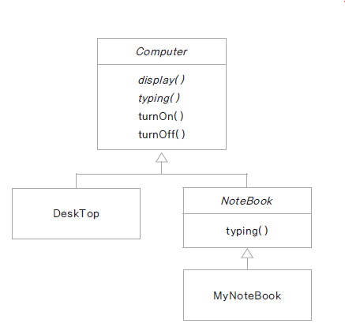

# 추상 클래스(abstract class) 구현하기

## 추상 클래스란?

- 구현 코드 없이 메서드의 선언만 있는 추상 메서드(abstract method)를 포함한 클래스

- 메서드 선언(declaration) : 반환타입, 메서드 이름, 매개변수로 구성

- 메서드 정의(definition) : 메서드 구현(implementation)과 동일한 의미 구현부(body) 를 가짐 ({ })

- 예) int add(int x, int y); // 선언 <br>
  &nbsp;&nbsp;&nbsp;int add(int x, int y){ } // 구현부가 있음, 추상 메서드 아님

- abstract 예약어를 사용

- 추상 클래스는 new 할 수 없음 ( 인스턴스화 할 수 없음 )

## 추상 클래스 구현하기

- 메서드에 구현 코드가 없으면 abstract 로 선언

- abstract로 선언된 메서드를 가진 클래스는 abstract로 선언

- 모든 메서드가 구현 된 클래스라도 abstract로 선언되면 추상 클래스로 인스턴스화 할 수 없음

- 추상 클래스의 추상 메서드는 하위 클래스가 상속 하여 구현

- 추상 클래스 내의 추상 메서드 : 하위 클래스가 구현해야 하는 메서드

- 추상 클래스 내의 구현 된 메서드 : 하위 클래스가 공통으로 사용하는 메서드 ( 필요에 따라 하위 클래스에서 재정의 함 )

- 예제 구현하기



Computer.java
```
public abstract class  Computer {

	abstract void display();
	abstract void typing();
	
	public void turnOn() {
		System.out.println("전원을 켭니다.");
	}
	
	public void turnOff() {
		System.out.println("전원을 끕니다.");
	}
}
```

DeskTop.java
```
public class DeskTop extends Computer{

	@Override
	void display() {
		System.out.println("DeskTop display");
	}

	@Override
	void typing() {
		System.out.println("DeskTop typing");
	}

	@Override
	public void turnOff() {
		System.out.println("Desktop turnoff");
	}
}
```

NoteBook.java
```
public abstract class NoteBook extends Computer{
	@Override
	public void typing() {
		System.out.println("NoteBook typing");		
	}
}
```

MyNoteBook.java
```
public class MyNoteBook extends NoteBook{

	@Override
	void display() {
		System.out.println("MyNoteBook display");		
	}
}
```

ComputerTest.java
```
public class ComputerTest {

	public static void main(String[] args) {
		Computer computer = new DeskTop();
		computer.display();
		computer.turnOff();
		
		NoteBook myNote = new MyNoteBook();
	}
}
```

# 추상 클래스의 응용 - 템플릿 메서드 패턴

## 템플릿 메서드

- 추상 메서드나 구현 된 메서드를 활용하여 코드의 흐름(시나리오)를 정의하는 메서드

- final로 선언하여 하위 클래스에서 재정의 할 수 없게 함

- 프레임워크에서 많이 사용되는 설계 패턴

- 추상 클래스로 선언된 상위 클래스에서 템플릿 메서드를 활용하여 전체적인 흐름을 정의 하고 하위 클래스에서

&nbsp;&nbsp;다르게 구현되어야 하는 부분은 추상 메서드로 선언하여 하위 클래스에서 구현 하도록 함

## 템플릿 메서드 예제


Car.java
```
public abstract class Car {
	
	public abstract void drive();
	public abstract void stop();
	
	public void startCar() {
		System.out.println("시동을 켭니다.");
	}
	
	public void turnOff() {
		System.out.println("시동을 끕니다.");
	}
			
	final public void run() {
		startCar();
		drive();
		stop();
		turnOff();
	}
}
```

ManualCar.java
```
public class ManualCar extends Car{

	@Override
	public void drive() {
		System.out.println("사람이 운전합니다.");
		System.out.println("사람이 핸들을 조작합니다.");		
	}

	@Override
	public void stop() {
		System.out.println("브레이크를 밟아서 정지합니다.");		
	}

}
```

AICar.java
```
public class AICar extends Car{

	@Override
	public void drive() {
		System.out.println("자율 주행합니다.");
		System.out.println("자동차가 스스로 방향을 바꿉니다.");
	}

	@Override
	public void stop() {
		System.out.println("스스로 멈춥니다.");		
	}
}
```

CarTest.java
```
public class CarTest {

	public static void main(String[] args) {
		Car aiCar = new AICar();
		aiCar.run();
		System.out.println("=================");
		Car manualCar = new ManualCar();
		manualCar.run();
	}
}
```


## final 예약어

- final 변수 : 값이 변경될 수 없는 상수

&nbsp;&nbsp; public static final double PI = 3.14;

- final 메서드 : 하위 클래스에서 재정의 할 수 없는 메서드

- final 클래스 : 상속할 수 없는 클래스

## 여러 자바 파일에서 사용하는 상수 값 정의

Define.java
```
public class Define {

	public static final int MIN = 1;
	public static final int MAX = 999999;
	public static final double PI = 3.14;
	public static final String GREETING = "Good Morning!";
	public static final int MATH_CODE = 1001;
	public static final int CHEMISTRY_CODE = 1002;
	
}
```

UsingDefine.java
```
public class UsingDefine {

	public static void main(String[] args) {

		System.out.println(Define.GREETING);
		System.out.println(Define.MIN);
		System.out.println(Define.MAX);
		System.out.println(Define.MATH_CODE);
		System.out.println(Define.CHEMISTRY_CODE);
		System.out.println("원주률은" + Define.PI + "입니다.");
	}

}
```