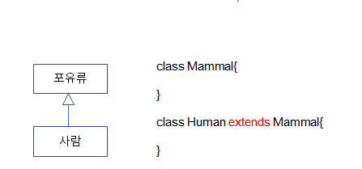
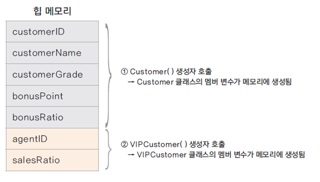

# 객체 간의 상속은 어떤 의미일까?

## 클래스 상속

- 새로운 클래스를 정의 할 때 이미 구현된 클래스를 상속(inheritance) 받아서 속성이나 기능을 확장하여 클래스를 구현함

- 이미 구현된 클래스보다 더 구체적인 기능을 가진 클래스를 구현해야 할때 기존 클래스를 상속함


    상속하는 클래스 : 상위 클래스, parent class, base class, super class

    상속받는 클래스 : 하위 클래스, child class, derived class, subclass

- 상속의 문법

class B extends A{


}

    extends 키워드 뒤에는 단 하나의 클래스만 올 수 있음
    
    자바는 단일 상속(single inheritance)만을 지원함

## 상속을 구현 하는 경우

- 상위 클래스는 하위 클래스 보다 더 일반적인 개념과 기능을 가짐

- 하위 클래스는 상위 클래스 보다 더 구체적인 개념과 기능을 가짐

- 하위 클래스가 상위 클래스의 속성과 기능을 확장 (extends)한다는 의미



# 상속을 활용한 멤버십 클래스 구현하기

## 멤버십 시나리오

    회사에서 고객 정보를 활용한 맞춤 서비스를 하기 위해 일반고객(Customer)과 
    이보다 충성도가 높은 우수고객(VIPCustomer)에 따른 서비스를 제공하고자 함

    물품을 구매 할때 적용되는 할인율과 적립되는 보너스 포인트의 비율이 다름 
    여러 멤버십에 대한 각각 다양한 서비스를 제공할 수 있음
    멤버십에 대한 구현을 클래스 상속을 활용하여 구현해보기

## 일반 고객(Customer) 클래스 구현

- 고객의 속성 : 고객 아이디, 고객 이름, 고객 등급, 보너스 포인트, 보너스 포인트 적립비율

- 일반 고객의 경우 물품 구매시 1%의 보너스 포인트 적립

```
package ch01;

public class Customer {

	private int customerID;
	private String customerName;
	private String customerGrade;
	int bonusPoint;
	double bonusRatio;
	
	public Customer() {
		customerGrade = "SILVER";
		bonusRatio = 0.01;
	}
	
	public int calcPrice(int price) {
		bonusPoint += price * bonusRatio;
		return price;
	}
	
	public String showCustomerInfo() {
		return customerName + "님의 등급은 " + customerGrade + 
				"이며, 보너스 포인트는" + bonusPoint + "입니다";
		
	}
}
```

## 우수 고객(VIPCustomer) 구현

    매출에 더 많은 기여를 하는 단골 고객

    제품을 살때 10%를 할인해 줌

    보너스 포인트는 제품 가격의 5%를 적립해 줌

    담당 전문 상담원이 배정됨

- Customer 클래스에 추가해서 구현하는 것은 좋지 않음

- VIPCustomer 클래스를 따로 구현

- 이미 Customer에 구현된 내용이 중복되므로 Customer를 확장하여 구현함(상속)

```
public class VIPCustomer extends Customer{

	private int agentID;
	double salesRatio;
	
	public VIPCustomer() {
		customerGrade = "VIP";    //오류 발생
		bonusRatio = 0.05;
		salesRatio = 0.1;
	}
	
	public int getAgentID() {
		return agentID;
	}
}
```


## protected 접근 제어자

- 상위 클래스에 선언된 private 멤버 변수는 하위 클래스에서 접근 할 수 없음

- 외부 클래스는 접근 할 수 없지만, 하위 클래스는 접근 할 수 있도록 protected 접근 제어자를 사용

Customer.java
```
	protected int customerID;
	protected String customerName;
	protected String customerGrade;

	//getter, setter 구현
	...
	public int getCustomerID() {
		return customerID;
	}

	public void setCustomerID(int customerID) {
		this.customerID = customerID;
	}

	public String getCustomerName() {
		return customerName;
	}

	public void setCustomerName(String customerName) {
		this.customerName = customerName;
	}

	public String getCustomerGrade() {
		return customerGrade;
	}

	public void setCustomerGrade(String customerGrade) {
		this.customerGrade = customerGrade;
	}

```


## Customer와 VIPCustomer 테스트하기

```
public class CustomerTest {

	public static void main(String[] args) {
		Customer customerLee = new Customer();
		customerLee.setCustomerName("이순신");
		customerLee.setCustomerID(10010);
		customerLee.bonusPoint = 1000;
		System.out.println(customerLee.showCustomerInfo());
			
			
		VIPCustomer customerKim = new VIPCustomer();
		customerKim.setCustomerName("김유신");
		customerKim.setCustomerID(10020);
		customerKim.bonusPoint = 10000;
		System.out.println(customerKim.showCustomerInfo());
	}
}
```

# 상속에서 클래스 생성 과정과 형 변환

## 하위 클래스가 생성 되는 과정

- 하위 클래스를 생성하면 상위 클래스가 먼저 생성 됨

- new VIPCustomer()를 호출하면 Customer()가 먼저 호출 됨

- 클래스가 상속 받은 경우 하위 클래스의 생성자에서는 반드시 상위 클래스의 생성자를 호출 함

Customer.java
```
public Customer() {
		customerGrade = "SILVER";
		bonusRatio = 0.01;
		
		System.out.println("Customer() 생성자 호출");
}
```

VIPCustomer.java
```
public VIPCustomer() {
		customerGrade = "VIP";
		bonusRatio = 0.05;
		salesRatio = 0.1;
		
		System.out.println("VIPCustomer() 생성자 호출");
}
```

## super 키워드

- 하위 클래스에서 가지는 상위 클래스에 대한 참조 값

- super()는 상위 클래스의 기본 생성자를 호출 함

- 하위 클래스에서 명시적으로 상위 클래스의 생성자를 호출하지 않으면 super()가 호출 됨<br>
  ( 이때 반드시 상위 클래스의 기본 생성자가 존재 해야 함)

- 상위 클래스의 기본 생성자가 없는 경우 ( 다른 생성자가 있는 경우 ) 하위 클래스에서는 생성자에서는 super를 이용하여
  명시적으로 상위 클래스의 생성자를 호출 함

- super는 생성된 상위 클래스 인스턴스의 참조 값을 가지므로 super를 이용하여 상위 클래스의 메서드나 멤버 변수에 접근할 수 있음

Customer.java
```
// 디폴트 생성자 없애고 매개 변수가 있는 생성자 추가
public Customer(int customerID, String customerName) {
		this.customerID = customerID;
		this.customerName = customerName;
		
		customerGrade = "SILVER";
		bonusRatio = 0.01;
		System.out.println("Customer(int, String) 생성자 호출");
}
```

VIPCustomer.java
```
// super를 이용하여 상위 클래스의 생성자 명시적으로 호출
public VIPCustomer(int customerID, String customerName) {
		super(customerID, customerName);
		
		customerGrade = "VIP";
		bonusRatio = 0.05;
		salesRatio = 0.1;
		
		System.out.println("VIPCustomer(int, String) 생성자 호출");
}
```

CustomerTest.java
```
public class CustomerTest {

	public static void main(String[] args) {
		
		Customer customerLee = new Customer(10010, "이순신");
		customerLee.bonusPoint = 1000;
		System.out.println(customerLee.showCustomerInfo());
		
		VIPCustomer customerKim = new VIPCustomer(10020, "김유신");
		customerKim.bonusPoint = 10000;
		System.out.println(customerKim.showCustomerInfo());
	}
}
```
- 출력 결과


## 상속에서 인스턴스 메모리의 상태

- 항상 상위 클래스의 인스턴스가 먼저 생성되고, 하위 클래스의 인스턴스가 생성 됨


## 형 변환(업캐스팅)

- 상위 클래스로 변수를 선언하고 하위 클래스의 생성자로 인스턴스를 생성

  Customer customerLee = new VIPCustomer();

- 상위 클래스 타입의 변수에 하위 클래스 변수가 대입;

  VIPCustomer vCustomer = new VIPCustomer();
  addCustomer(vCustomer);

  int addCustomer(Customer customer){
	}

- 하위 클래스는 상위 클래스의 타입을 내포하고 있으므로 상위 클래스로의 묵시적 형 변환이 가능함

- 상속 관계에서 모든 하위 클래스는 상위 클래스로 형 변환(업캐스팅)이 됨
- 다운 캐스팅을 하려면 VIPCustomer vipcustomer = new (VIPCustomer)customer; 로 명시적 타입 변환을 해주어야 한다.
- 다만 다운 캐스팅을 하고나면, 확장된 참조변수에는 값이 할당되어 있지 않을 수 있어서 새로 내가 값을 초기화 해주어야 할 필요성이 있을 수 있다,.


## 형 변환과 메모리

- Customer vc = new VIPCustomer(); 에서 vc가 가리키는 것은?

- VIPCustomer() 생성자에 의해 VIPCustomer 클래스의 모든 멤버 변수에 대한 메모리는 생성되었지만, <br>
  변수의 타입이 Customer 이므로 실제 접근 가능한 변수나 메서드는 Customer의 변수와 메서드임


  					

## 클래스의 계층구조가 여러 단계인 경우


- Human은 내부적으로 Promate와 mammal의 타입을 모두 내포하고 있음

  Primate pHumman = new Humman();

  Mammal mHumman = new Humman();
