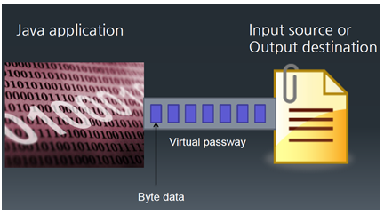
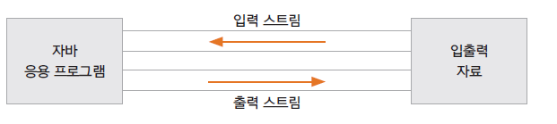
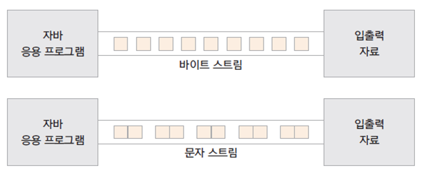

# 자바의 입출력을 위한 I/O 스트림

## 입출력 스트림

- 네트워크에서 자료의 흐름이 물의 흐름과 같다는 비유에서 유래됨

- 자바는 다양한 입출력 장치에 독립적으로 일관성있는 입출력을 입출력 스트림을 통해 제공

- 입출력이 구현되는 곳: 파일 디스크, 키보드, 마우스, 네트웍, 메모리 등 모든 자료가 입력되고 출력되는 곳



## 입출력 스트림의 구분

- 대상 기준 : 입력 스트림 / 출력 스트림

- 자료의 종류 : 바이트 스트림 / 문자 스트림

- 기능 : 기반 스트림 / 보조 스트림

## 입력 스트림과 출력 스트림

- 입력 스트림 : 대상으로부터 자료를 읽어 들이는 스트림

- 출력 스트림 : 대상으로 자료를 출력하는 스트림



- 스트림의 종류

| 종류 | 예시 |
| ------ | ------ |
| 입력 스트림 | FileInputStream, FileReader, BufferedInputStream, BufferedReader 등 |
| 출력 스트림 | FileOutputStream, FileWriter, BufferedOutputStream, BufferedWriter 등 |

## 바이트 단위 스트림과 문자 단위 스트림

- 바이트 단위 스트림 : 동영상, 음악 파일, 실행 파일등의 자료를 읽고 쓸 때 사용

- 문자 단위 스트림 : 바이트 단위로 자료를 처리하면 문자는 깨짐, 인코딩에 맞게 2바이트 이상으로 처리하도록 구현된 스트림



- 스트림의 종류

| 종류 | 예시 |
| ------ | ------ |
| 바이트 스트림 | FileInputStream, FileOutputStream, BufferedInputStream, BufferedOutputStream 등 |
| 문자 스트림 | FileReader, FileWriter, BufferedReader, BufferedWriter 등 |

## 기반 스트림과 보조 스트림

- 기반 스트림 : 대상에 직접 자료를 읽고 쓰는 기능의 스트림

- 보조 스트림 : 직접 읽고 쓰는 기능은 없이 추가적인 기능을 더해주는 스트림

- 보조 스트림은 직접 읽고 쓰는 기능은 없으므로 항상 기반 스트림이나 또 다른 보조 스트림을 생성자의 매개 변수로 포함함


- 스트림의 종류

| 종류 | 예시 |
| ------ | ------ |
| 기반 스트림 | FileInputStream, FileOutputStream, FileReader, FileWriter 등 |
| 보조 스트림 | InputStreamReader, OutputStreamWriter, BufferedInputStream, BufferedOutputStream 등 |


# 표준 입출력 스트림

## System 클래스의 표준 입출력 멤버

```
public class System{ 
	public static PrintStream out; 
	public static InputStream in; 
	public static PrintStream err; 
}
```

- System.out

표준 출력(모니터) 스트림

System.out.println("출력 메세지");

- System.in

표준 입력(키보드) 스트림

int d = System.in.read() // 한 바이트 읽기

- System.err

표준 에러 출력(모니터) 스트림

System.err.println("에러 메세지");

## System.in 사용하기 예제

```
public class SystemInTest1 {

	public static void main(String[] args) {
		System.out.println("알파벳 하나를 쓰고 [Enter]를 누르세요");
		
		int i;
		try {
			i = System.in.read();
			System.out.println(i);
			System.out.println((char)i);
		} catch (IOException e) {
			// TODO Auto-generated catch block
			e.printStackTrace();
		}
		
	}

}
```

```
public class SystemInTest2 {

	public static void main(String[] args) {
		System.out.println("알파벳 여러 개를 쓰고 [Enter]를 누르세요");
		
		int i;
		try {
			while( (i = System.in.read()) != '\n' ) {
				System.out.print((char)i);
			}
		} catch (IOException e) {
			e.printStackTrace();
		}
	}
}
```

# 바이트 단위 입출력 스트림

## InputStream

- 바이트 단위 입력 스트림 최상위 추상 클래스

- 많은 추상 메서드가 선언되어 있고 이를 하위 스트림이 상속받아 구현함

- 주요 하위 클래스

| 스트림 클래스 | 설명 |
| ------ | ------ |
| FileInputStream | 파일에서 바이트 단위로 자료를 읽습니다. |
| ByteArrayInputStream | byte 배열 메모리에서 바이트 단위로 자료를 읽습니다. |
| FilterInputStream | 기반 스트림에서 자료를 읽을 때 추가 기능을 제공하는 보조 스트림의 상위 클래스 |

- 주요 메서드

| 메서드 | 설명 |
| ------ | ------ |
| int read() | 입력 스트림으로부터 한 바이트의 자료를 읽습니다. 읽은 자료의 바이트 수를 반환합니다. |
| int read(byte b[]) | 입력 스트림으로 부터 b[] 크기의 자료를 b[]에 읽습니다. 읽은 자료의 바이트 수를 반환합니다. |
| int read(byte b[], int off, int len) | 입력 스트림으로 부터 b[] 크기의 자료를 b[]의 off변수 위치부터 저장하며 len 만큼 읽습니다. 읽은 자료의 바이트 수를 반환합니다. |
| void close() | 입력 스트림과 연결된 대상 리소스를 닫습니다. |

### FileInputStream 예제

- 파일에서 한 바이트씩 자료 읽기
```
public class FileInputStreamTest1 {

	public static void main(String[] args) {
		FileInputStream fis = null;
		
		try {
			fis = new FileInputStream("input.txt");
		
			System.out.println((char)fis.read());
			System.out.println((char)fis.read());
			System.out.println((char)fis.read());
		
		} catch (IOException e) {
			System.out.println(e);
		} finally{
			try {
				fis.close();
			} catch (IOException e) {
				System.out.println(e);
			} catch (NullPointerException e){
				System.out.println(e);
			}
		}
		System.out.println("end");
	}

}
```
- 파일의 끝까지 한 바이트씩 자료 읽기

```
public class FileInputStreamTest2 {

	public static void main(String[] args) {

		try(FileInputStream fis = new FileInputStream("input.txt")){ 
			int i;
			while ( (i = fis.read()) != -1){
				System.out.println((char)i);
			}
			System.out.println("end");
		} catch (FileNotFoundException e) {
			e.printStackTrace();
		} catch (IOException e) {
			e.printStackTrace();
		}
	}

}
```

- 파일에서 바이트 배열로 자료 읽기 ( 배열에 남아 있는 자료가 있을 수 있음에 유의 )

```
public class FileInputStreamTest3 {

	public static void main(String[] args) {
		 		
		try (FileInputStream fis = new FileInputStream("input2.txt")){
			
			byte[] bs = new byte[10];
			int i;
			while ( (i = fis.read(bs)) != -1){
				/*for(byte b : bs){
					System.out.print((char)b);
				}*/
				for(int k= 0; k<i; k++){
					System.out.print((char)bs[k]);
				}
				System.out.println(": " +i + "바이트 읽음" );
			}
			 
			/*while ( (i = fis.read(bs, 1, 9)) != -1){
				for(int k= 0; k<i; k++){
					System.out.print((char)bs[k]);
				}
				System.out.println(": " +i + "바이트 읽음" );
			}*/
		} catch (IOException e) {
			e.printStackTrace();
		}
		System.out.println("end");
	}
}
```


## OutputStream

- 바이트 단위 출력 스트림 최상위 추상 클래스

- 많은 추상 메서드가 선언되어 있고 이를 하위 스트림이 상속받아 구현함

- 주요 하위 클래스

| 스트림 클래스 | 설명 |
| ------ | ------ |
| FileOutputStream | 파일에서 바이트 단위로 자료를 씁니다. |
| ByteArrayOutputStream | byte 배열 메모리에서 바이트 단위로 자료를 씁니다. |
| FilterOutputStream | 기반 스트림에서 자료를 쓸 때 추가 기능을 제공하는 보조 스트림의 상위 클래스 |

- 주요 메서드

| 메서드 | 설명 |
| ------ | ------ |
| int write() | 한 바이트를 출력합니다. |
| int write(byte b[]) | b[] 크기의 자료를 출력합니다. |
| int write(byte b[], int off, int len) | b[] 배열에 있는 자료의 off 위치부터 len 개수만큼 자료를 출력합니다. |
| void flush() | 출력을 위해 잠시 자료가 머무르는 출력 버퍼를 강제로 비워 자료를 출력합니다. |
| void close() | 출력 스트림과 연결된 대상 리소스를 닫습니다. 출력 버퍼가 비워집니다. |


### FileOutputStream 예제

- 파일에 한 바이트씩 쓰기

```
public class FileOutputStreamTest1 {

	public static void main(String[] args) {
		
		try(FileOutputStream fos = new FileOutputStream("output.txt")){
			fos.write(65);  //A
			fos.write(66);  //B
			fos.write(67);  //C
		}catch(IOException e) {
			e.printStackTrace();
		}
		System.out.println("출력이 완료되었습니다.");
	}
}
```

- byte[] 배열에 A-Z 까지 넣고 배열을 한꺼번에 파일에 쓰기

```
public class FileOutputStreamTest2 {

	public static void main(String[] args) throws IOException {
		
		FileOutputStream fos = new FileOutputStream("output2.txt",true);
		try(fos){ //java 9 부터 제공되는 기능
		
			byte[] bs = new byte[26];
			byte data = 65;        //'A' 의 아스키 값
			for(int i = 0; i < bs.length; i++){  // A-Z 까지 배열에 넣기
				bs[i] = data;
				data++;
			}
			
			fos.write(bs);  //배열 한꺼번에 출력하기
		}catch(IOException e) {
			e.printStackTrace();
		}
		System.out.println("출력이 완료되었습니다.");
	}
}
```

- byte[] 배열의 특정 위치에서 부터 정해진 길이 만큼 쓰기

```
public class FileOutputStreamTest3 {

	public static void main(String[] args) {
		 
		try(FileOutputStream fos = new FileOutputStream("output3.txt"))
		{
		
			byte[] bs = new byte[26];
			byte data = 65;     //'A' 의 아스키 값
			for(int i = 0; i < bs.length; i++){  // A-Z 까지 배열에 넣기
				bs[i] = data;
				data++;
			}
			fos.write(bs, 2, 10);   // 배열의 2 번째 위치부터 10 개 바이트 출력하기
		}catch(IOException e) {
			e.printStackTrace();
		}
		System.out.println("출력이 완료되었습니다.");
	}
}
```

### flush() 와 close() 메서드

- 출력 버퍼를 비울때 flush() 메서드를 사용

- close() 메서드 내부에서 flush()가 호출되므로 close()메서드가 호출되면 출력 버퍼가 비워짐

# 여러가지 보조 스트림 클래스들

## 보조 스트림

- 실제 읽고 쓰는 스트림이 아닌 보조 기능을 제공하는 스트림

- FilterInputStream과 FilterOutputStream이 보조 스트림의 상위 클래스들

- 생성자의 매개변수로 또 다른 스트림(기반 스트림이나 다른 보조 스트림)을 가짐

- Decorator Pattern으로 구현 됨

- 상위 클래스 생성자

| 생성자 | 설명 |
| ------ | ------ |
| protected FilterInputStream과(InputStream in) | 생성자의 매개변수로 InputStream을 받습니다. |
| public FilterOutputStream(OutputStream out) | 생성자의 매개변수로 OutputStream을 받습니다. |


### InputStreamReader와 OutputStreamWriter

- 바이트 단위로 읽거나 쓰는 자료를 문자로 변환해주는 보조 스트림

- FileInputStream으로 읽은 자료를 문자로 변환해주는 예

```
public class InputStreamReaderTest {

	public static void main(String[] args) {

		try(InputStreamReader isr = new InputStreamReader(new FileInputStream("reader.txt"))){
			int i;
			while( (i = isr.read()) != -1){  //보조 스트림으로 읽습니다.
				System.out.print((char)i);
			}
		}catch(IOException e) {
			e.printStackTrace();
		}
	}
}
```

### BufferedInputStream과 BufferedOutputStream

- 약 8k의 배열이 제공되어 입출력이 빠르게 하는 기능이 제공되는 보조 스트림

- BufferedReader와 BufferedWriter는 문자용 입출력 보조 스트림

- BufferedInputStream과 BufferedOutputStream을 이용하여 파일 복사하는 예

```
public class BufferedStreamTest {

	public static void main(String[] args) {

		long millisecond = 0;
		try(FileInputStream fis = new FileInputStream("a.zip");
				FileOutputStream fos = new FileOutputStream("copy.zip");
				BufferedInputStream bis = new BufferedInputStream(fis);
				BufferedOutputStream bos = new BufferedOutputStream(fos)){
		
			millisecond = System.currentTimeMillis();
			
			int i;
			while( ( i = bis.read()) != -1){
				bos.write(i);
			}
			
			millisecond = System.currentTimeMillis() - millisecond;
		}catch(IOException e) {
			e.printStackTrace();
		}
		
		System.out.println("파일 복사 하는 데 " + millisecond + " milliseconds 소요되었습니다.");
	}
}
```

### DataInputStream과 DataOutputStream

- 자료가 메모리에 저장된 상태 그대로 읽거나 쓰는 스트림

- DataInputStream 메서드


- DataOutputStream 메서드


```
public class DataStreamTest {

	public static void main(String[] args) {


		try(FileOutputStream fos = new FileOutputStream("data.txt");
				DataOutputStream dos = new DataOutputStream(fos))
		{
		
			dos.writeByte(100);
			dos.writeChar('A');
			dos.writeInt(10);
			dos.writeFloat(3.14f);
			dos.writeUTF("Test");
		}catch(IOException e) {
			e.printStackTrace();
		}
		
		try(FileInputStream fis = new FileInputStream("data.txt");
				DataInputStream dis = new DataInputStream(fis))
		{
		
			System.out.println(dis.readByte());
			System.out.println(dis.readChar());
			System.out.println(dis.readInt());
			System.out.println(dis.readFloat());
			System.out.println(dis.readUTF());
		}catch (IOException e) {
			e.printStackTrace();
		}
	}
}
```


