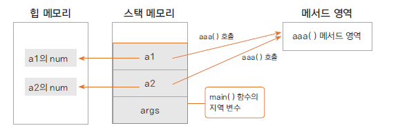
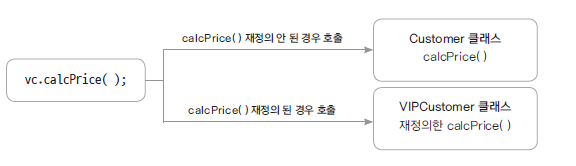

# 함수와 메서드

## 함수란 (function) 

- 하나의 기능을 수행하는 일련의 코드

- 구현된(정의된) 함수는 호출하여 사용하고 호출된 함수는 기능이 끝나면 제어가 반환됨

- 함수로 구현된 하나의 기능은 여러 곳에서 동일한 방식으로 호출되어 사용될 수 있음


## 함수 정의하기

함수는 이름, 매개 변수, 반환 값, 함수 몸체(body)로 구성됨

```
int add(int num1, int num2) {
		
	int result;
	result = num1 + num2;
	return result;
}
```

## 함수 구현하기 예제

```
public class FunctionTest {
	
	public static int addNum(int num1, int num2) {
		int result;
		result = num1 + num2;
		return result;
	}
	
	public static void sayHello(String greeting) {
		System.out.println(greeting);
	}
	
	public static int calcSum() {
		
		int sum = 0;
		int i;
		
		for(i = 0; i<=100; i++) {
			sum += i;
		}
		
		return sum;
	}

	public static void main(String[] args) {
		
		int n1 = 10;
		int n2 = 20;
		
		int total = addNum(n1, n2);
		
		sayHello("안녕하세요");
		int num = calcSum();
		
		System.out.println(total);
		System.out.println(num);
	}
}
```

## 함수 호출과 스택 메모리 

- 스택 : 함수가 호출될 때 지역 변수들이 사용하는 메모리  

- 함수의 수행이 끝나면 자동으로 반환 되는 메모리


## 메서드 (method) 

- 객체의 기능을 구현하기 위해 클래스 내부에 구현되는 함수

- 멤버 함수 (member function)이라고도 함

- 메서드를 구현함으로써 객체의 기능이 구현 됨

- 메서드의 이름은 그 객체를 사용하는 객체(클라이언트)에 맞게 짓는것이 좋음

   예) getStudentName()

# 메서드 재정의와 가상 메서드 원리

## 메서드는 어떻게 호출되고 실행 되는가?

- 메서드(함수)의 이름은 주소값을 나타냄

- 메서드는 명령어의 set 이고 프로그램이 로드되면 메서드 영역(코드 영역)에 명령어 set이 위치

- 해당 메서드가 호출 되면 명령어 set 이 있는 주소를 찾아 명령어가 실행됨

- 이때 메서드에서 사용하는 변수들은 스택 메모리에 위치 하게됨

- 따라서 다른 인스턴스라도 같은 메서드의 코드는 같으므로 같은 메서드가 호출됨

- 인스턴스가 생성되면 변수는 힙 메모리에 따로 생성되지만, 메서드 명령어 set은 처음 한번만 로드 됨

```
public class TestMethod {

	int num;
	
	void aaa() {
		System.out.println("aaa() 호출");
	}
	
	public static void main(String[] args) {
		
		TestMethod a1 = new TestMethod();
		a1.aaa();
		
		TestMethod a2 = new TestMethod();
		a2.aaa();
	}

}
```


## 가상 메서드의 원리

- 가상 메서드 테이블(vitual method table)에서 해당 메서드에 대한 address를 가지고 있음

- 재정의된 경우는 재정의 된 메서드의 주소를 가리킴<br>
  <br>

<br>
