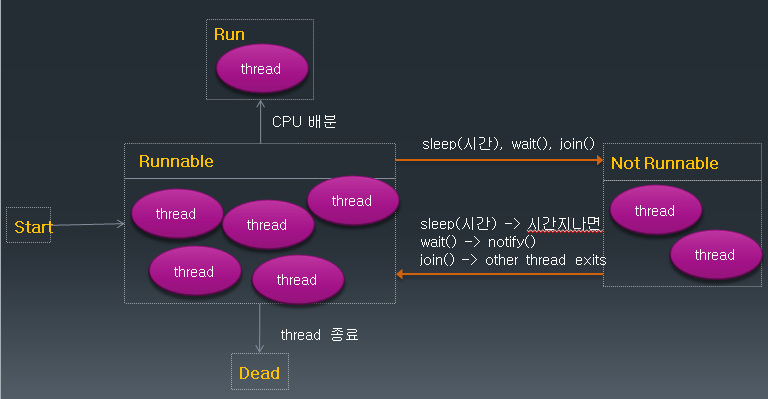

# 자바에서 Thread 만들기

## Thread 란?

- process
  실행 중인 프로그램
  프로그램이 실행되면 OS로 부터 메모리를 할당받아 프로세스 상태가 됨

- thread
  하나의 프로세스는 하나 이상의 thread를 가지게 되고, 실제 작업을 수행하는 단위는 thread임


## multi-threading

- 여러 thread가 동시에 수행되는 프로그래밍, 여러 작업이 동시에 실행되는 효과

- thread는 각각 자신만의 작업 공간을 가짐 ( context )

- 각 thread 사이에서 공유하는 자원이 있을 수 있음 (자바에서는 static instance)

- 여러 thread가 자원을 공유하여 작업이 수행되는 경우 서로 자원을 차지하려는 race condition이 발생할 수 있음

- 이렇게 여러 thread가 공유하는 자원중 경쟁이 발생하는 부분을 critical section 이라고 함

- critical section에 대한 동기화( 일종의 순차적 수행)를 구현하지 않으면 오류가 발생할 수 있음


## 자바 Thread 만들기

### Thread 클래스 상속하여 만들기

```
class MyThread extends Thread{
	
	public void run() {
		
		int i;
		for(i = 0; i<200; i++) {
			System.out.print(i + "\t");
		}
	}
}

public class ThreadTest {

	public static void main(String[] args) {

		System.out.println(Thread.currentThread());
		MyThread th1 = new MyThread();
		th1.start();
		
		MyThread th2 = new MyThread();
		th2.start();
	}

}
```

### Runnable 인터페이스 구현하여 만들기

- 자바는 다중 상속이 허용되지 않으므로 이미 다른 클래스를 상속한 경우 thread를 만들기 위해 Runnable interface를 구현하도록 한다.

```
class MyThread2 implements Runnable{

	public void run(){
		
		int i;
		for(i=0; i<200; i++){
			
			System.out.print(i + "\t");
	
			
		}
	}
}


public class ThreadTest2 {

	public static void main(String[] args) {

		System.out.println("main start");
		
		MyThread2 mth = new MyThread2();
		Thread th1 = new Thread(mth);
		th1.start();
		
		Thread th2 = new Thread(new MyThread2());
		th2.start();
		
		System.out.println("main end");
	}

}
```

## Thread Status



# Thread 클래스의 여러 메서드들

## Thread 우선순위

- Thread.MIN_PRIORITY(=1) ~ Thread.MAX_PRIORITY(=10)

- 디폴트 우선순위 : Thread.NORMAL_PRIORITY(=5)

- 우선 순위가 높은 Thread가 CPU의 배분을 받을 확률이 높다

- setPriority()/getPriority()

- Thread 우선순위 예제

```
class PriorityThread extends Thread{
	
	public void run(){
	
		int sum = 0;
		
		Thread t = Thread.currentThread();
		System.out.println( t + "start");
		
		for(int i =0; i<=1000000; i++){
			
			sum += i;
		}
		
		System.out.println( t.getPriority() + "end");
	}
}


public class PriorityTest {

	public static void main(String[] args) {

		int i;
		for(i=Thread.MIN_PRIORITY; i<= Thread.MAX_PRIORITY; i++){
			
			PriorityThread pt = new PriorityThread();
			pt.setPriority(i);
			pt.start();
		
		}
	}

}

```

## join()

- 동시에 두 개 이상의 Thread가 실행 될 때 다른 Thread의 결과를 참조 하여 실행해야 하는 경우 join() 함수를 사용

- join() 함수를 호출한 Thread가 not-runnable 상태가 감

- 다른 Thread의 수행이 끝나면 runnable 상태로 돌아옴


- 1부터 50, 51부터 100 까지의 합을 구하는 두 개의 Thread를 만들어 그 결과를 확인해보세요

```
public class JoinTest extends Thread{
	
	int start;
	int end;
	int total;
	
	public JoinTest(int start, int end){
		this.start = start;
		this.end = end;
	}
	
	public void run(){
	
		int i;
		for(i = start; i <= end; i++){
			total += i;
		}
	}
	

	public static void main(String[] args) {

		JoinTest jt1 = new JoinTest(1, 50);
		JoinTest jt2 = new JoinTest(51, 100);
		
				
		jt1.start();
		jt2.start();
		
		try{
			jt1.join();
			jt2.join();
			
		}catch (InterruptedException e) {
			System.out.println(e);
		}
		
		
		int lastTotal = jt1.total + jt2.total;
		
		System.out.println("jt1.total = " + jt1.total);
		System.out.println("jt2.total = " + jt2.total);
		
		System.out.println("lastTotal = " + lastTotal);
		
				
	}

}
```

## interrupt()

- 다른 Thread에 예외를 발생시키는 interrupt를 보낸다.

- Thread가 join(), sleep(), wait() 함수에의해 not-runnable 상태일 때 interrupt() 메서드를 호출하면 다시 runnable 상태가 될 수 있음


## Thread 종료하기

- Thread를 종료할 때 사용함

- 무한 반복의 경우 while(flag)의 flag 변수값을 false로 바꾸어 종료를 시킴

- Thread 종료하기 예제

  	세 개의 thread를 만든다.
  	각각 무한 루프를 수행하게 한다. 	
  	작업 내용 this.sleep(100);

  	‘A’ 를 입력 받으면 첫 번째 thread를
  	‘B’ 를 입력 받으면 두 번째 thread를
  	‘C’ 를 입력 받으면 세 번째 thread를 
  	‘M’을 입력 받으면 모든 thread와 main() 함수를 종료한다.

```
public class TerminateThread extends Thread{

	private boolean flag = false;
	int i;
	
	public TerminateThread(String name){
		super(name);
	}
	
	public void run(){
		
		
		while(!flag){
			try {
				sleep(100);
			} catch (InterruptedException e) {
				// TODO Auto-generated catch block
				e.printStackTrace();
			}
		}
		
		System.out.println( getName() + " end" );
		
	}
	
	public void setFlag(boolean flag){
		this.flag = flag;
	}
	
	
	public static void main(String[] args) throws IOException {

		TerminateThread threadA = new TerminateThread("A");
		TerminateThread threadB = new TerminateThread("B");
		TerminateThread threadC = new TerminateThread("C");
		
		threadA.start();
		threadB.start();
		threadC.start();
		
		int in;
		while(true){
			in = System.in.read();
			if ( in == 'A'){
				threadA.setFlag(true);
			}else if(in == 'B'){
				threadB.setFlag(true);
			}else if( in == 'C'){
				threadC.setFlag(true);
			}else if( in == 'M'){
				threadA.setFlag(true);
				threadB.setFlag(true);
				threadC.setFlag(true);
				break;
			}else{
				System.out.println("type again");
			}
		}
		
		System.out.println("main end");
		
	}
}
```
# 멀티 Thread 프로그래밍에서의 동기화

## critical section 과 semaphore

- critical section  은 두 개 이상의 thread가 동시에 접근 하는 경우 문제가 생길 수 있기 때문에 동시에 접근할 수 없는 영역

- semaphore 는 특별한 형태의 시스템 객체이며 get/release 두 개의 기능이 있다.

- 한 순간 오직 하나의 thread 만이 semaphore를 얻을 수 있고, 나머지 thread들은 대기(blocking) 상태가 된다.

- semaphore를 얻은 thread 만이 critical section에 들어갈 수 있다.


- Park 과 ParkWife 가 동시에 Bank 자원에 접근하여 작업이 이루어지는 경우의 예제

```
class Bank{
	
	private int money = 10000;
	
	public synchronized  void saveMoney(int save){
		
		int m = this.getMoney();
		
		try {
			Thread.sleep(3000);
		} catch (InterruptedException e) {
			// TODO Auto-generated catch block
			e.printStackTrace();
		}
		
		setMoney( m + save);
	}
	
	public synchronized  void minusMoney(int minus){
		
		
			int m = this.getMoney();
			
			try {
				Thread.sleep(200);
			} catch (InterruptedException e) {
				// TODO Auto-generated catch block
				e.printStackTrace();
			}
			
			setMoney( m - minus);
			
			
	}
	
	public int getMoney(){
		return money;
	}
	
	public void setMoney(int money){
		this.money = money;
	}
}

class Park extends Thread{
	
	public  void run(){
		System.out.println("start save");
		SyncMain.myBank.saveMoney(3000);
		System.out.println("saveMoney(3000): " + SyncMain.myBank.getMoney() );	
	}
}

class ParkWife extends Thread{
	
	public void run(){
		System.out.println("start minus");
		SyncMain.myBank.minusMoney(1000);
		System.out.println("minusMoney(1000): " + SyncMain.myBank.getMoney() );
		
	}
	
}

public class SyncMain {

	public static Bank myBank = new Bank();
	
	public static void main(String[] args) throws InterruptedException {
		
		Park p = new Park();
		p.start();
		
		Thread.sleep(200);
		
		ParkWife pw = new ParkWife();
		pw.start();
	}

}
```

## 동기화 (synchronization)

- 두 개의 thread 가 같은 객체에 접근 할 경우, 동시에 접근 함으로써 오류가 발생

- 동기화는 임계영역에 접근한 경우 공유자원을 lock 하여 다른 thread의 접근을 제어

- 동기화를 잘못 구현하면 deadlock에 빠질 수 있다.

## 자바에서는 synchronized 메서드나 synchronized 블럭을 사용

### synchronized 블럭

-현재 객체 또는 다른 객체를 lock으로 만든다.

```
synchronized(참조형 수식) {

      수행문;
}
```

### synchronized 메서드

- 객체의 메소드에 synchronized 키워드 사용

- 현재 이 메서드가 속해있는 객체에 lock을 건다.

- 자바에서는 deadlock을 방지하는 기술이 제공되지 않으므로 되도록이면 synchronized 메서드에서 다른 synchronized 메서드는 호출하지 않도록 한다.

- deadlock의 예


# wait()/notify() 에서드를 활용한 동기화 프로그래밍

- 리소스가 어떤 조건에서 더 이상 유효하지 않은 경우 리소스를 기다리기 위해 Thread 가 wait() 상태가 된다.

- wait() 상태가 된 Thread은 notify() 가 호출 될 때까지 기다린다.

- 유효한 자원이 생기면 notify()가 호출되고 wait() 하고 있는 Thread 중 무작위로 하나의 Thread를 재시작 하도록 한다.

- notifyAll()이 호출되는 경우 wait() 하고 있는 모든 Thread가 재시작 된다.

- 이 경우 유효한 리소스만큼의 Thread만이 수행될 수 있고 자원을 갖지 못한 Thread의 경우는 다시 wait() 상태로 만든다.

- 자바에서는 notifyAll() 메서드의 사용을 권장한다.

- 도서관에서 책을 빌리는 예제

### notify()를 사용하는 경우
```
class FastLibrary{
	
	public ArrayList<String> shelf = new ArrayList<String>();
	
	public FastLibrary(){
		
		shelf.add("태백산맥 1");
		shelf.add("태백산맥 2");
		shelf.add("태백산맥 3");
	}
	
	public synchronized String lendBook() throws InterruptedException{
		
		Thread t = Thread.currentThread();
		
		if(shelf.size() == 0 ) {
			System.out.println(t.getName() + " waiting start");
			wait();
			System.out.println(t.getName() + " waiting end");
		}
		String book = shelf.remove(0);
		System.out.println(t.getName() + ": " + book + " lend");
	
		return book;
	}
	
	public synchronized void returnBook(String book){
		Thread t = Thread.currentThread();
		
		shelf.add(book);
		notify();
		System.out.println(t.getName() + ": " + book + " return");
	}
	
}

class Student extends Thread{
	
	public void run(){

		try{
				
			
			String title = LibraryMain.library.lendBook();
			if( title == null ) return;
			sleep(5000);
			LibraryMain.library.returnBook(title);
			
		}catch (InterruptedException e) {
			System.out.println(e);
		}
	}
	
}

public class LibraryMain {

	public static FastLibrary library = new FastLibrary(); 
	public static void main(String[] args) {

		Student std1 = new Student();
		Student std2 = new Student();
		Student std3 = new Student();
		Student std4 = new Student();
		Student std5 = new Student();
		Student std6 = new Student();
		
		std1.start();
		std2.start();
		std3.start();
		std4.start();
		std5.start();
		std6.start();
	}

}
```

### notifyAll()을 사용하는 경우

lendBook()/ returnBook() 메서드 수정
```
public synchronized String lendBook() throws InterruptedException{
		
		Thread t = Thread.currentThread();
		
		while( shelf.size() == 0 ){
			System.out.println(t.getName() + " waiting start");
			wait();
			System.out.println(t.getName() + " waiting end");
		}
		String book = shelf.remove(0);
		System.out.println(t.getName() + ": " + book + " lend");
		
		return book;
	}
}

public synchronized void returnBook(String book){

		Thread t = Thread.currentThread();
		
		shelf.add(book);
		notifyAll();
		System.out.println(t.getName() + ": " + book + " return");
}
```
