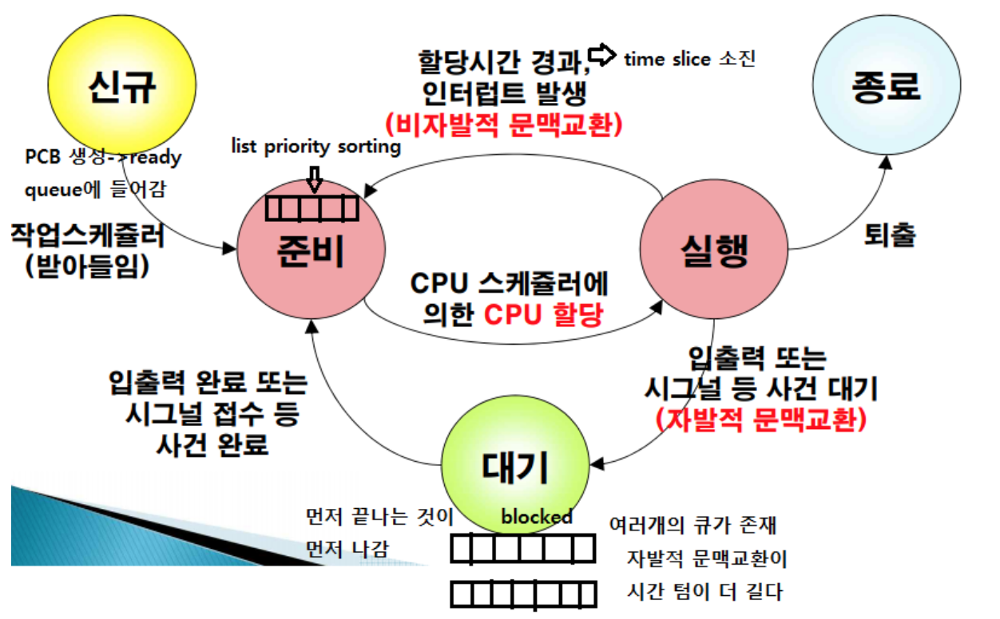

# Context Switch

## Context Switching이란?

작업하고 있는 Task\(Process, Thread\)의 인터럽트 요청에 의해 상태를 저장하고 다른 Task를 전환하는 과정을 말한다.

### 왜 인터럽트 요청이 필요할까?

CPU 당 하나의 Task\(Process / Thread\)만 실행할 수 있기 때문에, 사용자에게 멀티 태스킹을 지원하기 위해선 Task를 Swtiching 하며 구동되어야 한다. Task간에 Switching 하는 과정에서 발생하는 요청이 인터럽트 요청이라 할 수 있다.

### Context란?

CPU가 다루는 Task\(Process / Thread\)에 대한 정보로 대부분의 정보는 Register에 저장되며 PCB\(Process Control Block\)으로 관리된다.

PCB는 OS에 의해 스케줄링되는 Process Control Block이다.

#### Process와 Thread의 차이는 무엇인가?

* Process :
  * 메모리에 올라와 실행되고 있는 프로그램의 독립적인 개체이다.
  * 운영체제로부터 시스템 자원을 할당받는 작업의 단위이다.
  * 프로세스는 각각 독립된 메모리 영역\(Code, Data, Stack, Heap\)을 할당받는다.
  * 프로세스 당 최소 1개의 스레드\(메인 스레드\)를 가지고 있다.
  * 프로세스간의 자원을 접근하기 위해선 프로세스 간의 통신\(IPC, Inter-process-commuincation\)을 사용해야 한다.
    * ex. 파이프, 파일, 소켓 등을 이용한 통신 방법
* Thread :
  * 프로세스내에서 실행되는 여러 흐름의 단위\(프로세스가 할당받은 자원을 이용하는 실행의 단위\)
  * 스레드는 프로세스 내에서 각각 Stack 영역만 별도로 할당받고 Code, Data, Heap 영역은 공유한다.
  * 각각의 스레드는 별도의 레지스터와 스택을 갖고 있지만, 힙 메모리는 서로 읽고 쓸 수 있다.

## 멀티 프로세스와 멀티 스레드

### 멀티 프로세스

* 하나의 응용 프로그램을 여러개의 프로세스로 구성하여 각 프로세스가 하나의 작업을 처리한다.
* 특정 작업의 프로세스가 죽어도 다른 프로세스에는 영향이 없다.

### 멀티 스레드

* 하나의 응용 프로그램을 여러 개의 스레드로 구성하여 각 스레드가 하나의 작업을 처리한다.
* 스레드 간 데이터를 공유할 수 있어 시스템 자원 소모가 줄어든다.

### Context Switching 비용

* Cache 초기화
* Memory Mapping 초기화

#### Process와 Thread 비용 차이

* 프로세스 컨텍스트 스위칭이 일어났을 경우, 공유하는 데이터가 없으므로 캐쉬가 지금껏 쌓아놓은 데이터들이 무너지고 새로 캐쉬정보를 쌓아야 한다. 이것이 프로세스 컨텍스트 스위칭에 부담이 되는 요소이다.
* 반면, 쓰레드라면 저장된 캐쉬 데이터는 쓰레드가 바뀌어도 공유하는 데이터\(code, data, heap영역\)가 있으므로 의미있다. 그러므로 컨텍스트 스위칭이 빠른 것이다.
* 단, 공유하는 영역이 있기 때문에 쓰레드간에 동기화 하는 문제가 발생할 수 있다.

## 참고

* [https://nesoy.github.io/articles/2018-11/Context-Switching](https://nesoy.github.io/articles/2018-11/Context-Switching)
* [https://gmlwjd9405.github.io/2018/09/14/process-vs-thread.html](https://gmlwjd9405.github.io/2018/09/14/process-vs-thread.html)

