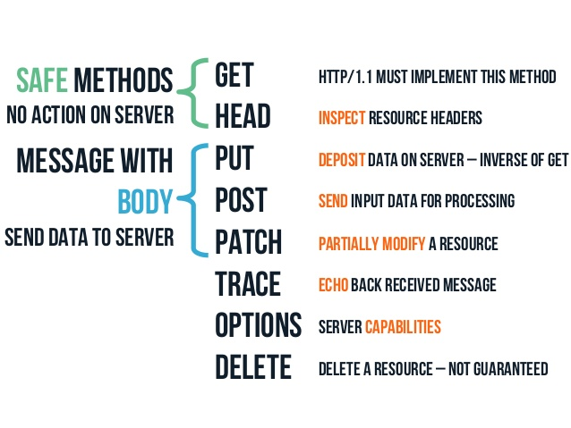

# HTTP METHOD



## HTTP METHOD

### GET

* 요청받은 URI의 정보를 검색하여 응답한다.
* GET을 사용하는 요청은 오직 데이터를 받기만 한다.
* 전송 형태 : GET \[request-uri\]?query\_string

### HEAD

* HEAD 메서드는 GET 메서드의 요청과 동일한 응답을 요구하지만, 응답 본문을 포함하지 않는다.
* 웹서버 정보확인, 헬스체크, 버젼확인, 최종 수정일자 확인등의 용도로 사용된다.
* 전송 형태 : HEAD \[request-uri\]

### POST

* 요청된 자원을 생성\(CREATE\)한다.
* 새로 작성된 리소스인 경우 HTTP헤더 항목 Location : URI주소를 포함하여 응답한다.
* 전송 형태 : POST \[request-uri\] Content-Type:\[Content Type\] \[데이터\]

### PUT

* 요청된 자원을 수정\(UPDATE\)한다.
* 내용 갱신을 위주로 Location : URI를 보내지 않아도 된다.
* 클라이언트측은 요청된 URI를 그대로 사용하는 것으로 간주한다.
* 전송 형태 : PUT \[request-uri\] Content-Type:\[Content Type\] \[데이터\]

### PATCH

* PUT과 유사하게 요청된 자원을 수정\(UPDATE\)할 때 사용한다.
* PUT의 경우 자원 전체를 갱신하는 의미지만, PATCH는 해당 자원의 일부를 교체하는 의미로 사용한다.
* 전송 형태 : PATCH \[request-uri\] Content-Type:\[Content Type\] \[데이터\]

### DELETE

* 요청된 자원을 삭제할 것을 요청함.
* 안전성 문제로 대부분의 서버에서 비활성한다.
* 전송 형태 : DELETE \[request-uri\]

### CONNECT

* 동적으로 터널 모드를 교환, 프락시 기능을 요청시 사용한다.
* 전송 형태 : CONNECT \[request-uri\]

### TRACE

* 원격지 서버에 루프백 메시지 호출하기 위해 테스트용으로 사용한다.
* 전송 형태 : TRACE \[request-uri\]

### OPTIONS

* 웹서버에서 지원되는 메소드의 종류를 확인할 경우 사용한다.
* 전송 형태 : OPTIONS \[request-uri\]

## POST vs PUT

* POST는 리소스를 생성할 때 사용하므로 식별자가 필요 없다.
* PUT은 기존의 리소스를 수정하는 용도로 식별자가 필요하다.
* POST는 요청마다 리소스가 생성되므로 멱등하지 않다.
* PUT은 동일한 요청에 동일한 리소스를 유지하므로 멱등하다.

## PATCH vs PUT

* PUT은 식별자에 해당하는 리소스 전체를 교체하는 용도로 사용한다.
* PATCH는 식별자에 해당하는 리소스의 특정 필드만 교체한다.

```text
PUT /members/1
{
    name : "hoon",
    age : 28,
}

PATCH  /members/1
{
    name : "jihoon"
}
```

## TRACE 보안 이슈

2002년에 MS가 자사의 인터넷 익스플로러 6.0 SP1에 \*\*`[HttpOnly](<https://webhack.dynu.net/?idx=20161110.002>)`\*\*라는 개념을 도입하여 XSS 공격에 의한 세션탈취를 방지하였다. 세션쿠키\(또는 세션ID\)에 HttpOnly라는 속성을 부여하면 HTTP 통신에서만 이 쿠키를 사용하게 함으로써 자바스크립트나 기타 클라이언트 측 프로그램이 해당 쿠키를 접근할 수 없도록 차단하는 방법이다. 간단하면서도 효과적인 세션탈취 방어책이다.

그런데 2003년에 `TRACE` 메소드를 허용하는 웹서버에서는 이 `HttpOnly` 방어책을 우회할 수 있는 방법이 발견되었다\([**Jeremiah Grossman의 Cross-site Tracing 최초 보고서**](http://www.cgisecurity.com/whitehat-mirror/WhitePaper_screen.pdf)\). `TRACE` 메소드는 웹 브라우저가 보내는 HTTP 통신을 반사하는 역할을 한다. 그런데 HTTP 통신 상에는 클라이언트가 보내는 쿠키가 포함되므로 이 통신을 가로채면 HttpOnly로 선언된 쿠키값도 탈취를 할 수 있다.

## HTTP 최적화

### HTTP caching

* 정적인 리소스는 Cache-Control 헤더 속성을 사용하여 브라우저 상에 저장하도록 캐싱 기능을 활용할 수 있다.

```text
Cache-Control: max-age=31536000
```

### HTTP compression

* 압축을 이용해서도 부하를 줄일 수 있다.
* 압축 비용이 추가되겠지만, 네트워크 통신 비용보다는 압축 비용이 싸기 때문에 압축을 이용해서도 성능 향상을 할 수 있다.

```text
// 클라이언트 측에서는 리퀘스트 헤더로 가능한 압축 방법 목록을 알릴 수 있습니다.
Request Header
accept:*/*
accept-encoding:gzip, deflate, br

// 서버 측에서는 사용한 압축 방법을 Response의 Content-Encoding 헤더에 담아 알려줍니다.
Response Header
Content-Encoding: gzip
```

## 참고

* [https://javaplant.tistory.com/18](https://javaplant.tistory.com/18)
* [https://developer.mozilla.org/ko/docs/Web/HTTP/Methods](https://developer.mozilla.org/ko/docs/Web/HTTP/Methods)
* [https://xmfpes.github.io/web-network/network-http/](https://xmfpes.github.io/web-network/network-http/)
* [https://webhack.dynu.net/?idx=20161111.001](https://webhack.dynu.net/?idx=20161111.001)

