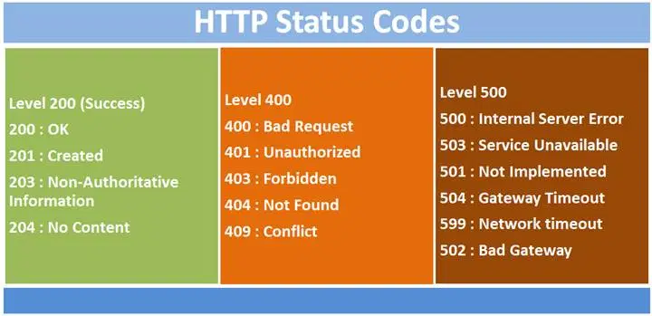

# HTTP STATUS

## 정보전송 임시 응답

| 응답대역 | 응답코드 |
| :--- | :--- |
| 100 | Continue \(클라이언트로 부터 일부 요청을 받았으며 나머지 정보를 계속 요청함\) |
| 101 | Switching protocols |

## 성공

| 응답대역 | 응답코드 |
| :--- | :--- |
| 200 | OK\(요청이 성공적으로 수행되었음 |
| 201 | Created \(PUT 메소드에 의해 원격지 서버에 파일 생성됨\) |
| 202 | Accepted\(웹 서버가 명령 수신함\) |
| 203 | Non-authoritative information \(서버가 클라이언트 요구 중 일부만 전송\) |
| 204 | No content, \(PUT, POST, DELETE 요청의 경우 성공은 했지만 전송할 데이터가 없는 경우\) |

## 리다이렉션

| 응답대역 | 응답코드 |
| :--- | :--- |
| 301 | Moved permanently \(요구한 데이터를 변경된 타 URL에 요청함 / Redirect된 경우\) |
| 302 | Not temporarily |
| 304 | Not modified \(컴퓨터 로컬의 캐시 정보를 이용함, 대개 gif 등은 웹 서버에 요청하지 않음\) |

## 클라이언트 요청 에러

| 응답대역 | 응답코드 |
| :--- | :--- |
| 400 | Bad Request \(사용자의 잘못된 요청을 처리할 수 없음\) |
| 401 | Unauthorized \(인증이 필요한 페이지를 요청한 경우\) |
| 402 | Payment required\(예약됨\) |
| 403 | Forbidden \(접근 금지, 디렉터리 리스팅 요청 및 관리자 페이지 접근 등을 차단\) |
| 404 | Not found, \(요청한 페이지 없음\) |
| 405 | Method not allowed \(혀용되지 않는 http method 사용함\) |
| 407 | Proxy authentication required \(프락시 인증 요구됨\) |
| 408 | Request timeout \(요청 시간 초과\) |
| 410 | Gone \(영구적으로 사용 금지\) |
| 412 | Precondition failed \(전체 조건 실패\) |
| 414 | Request-URI too long \(요청 URL 길이가 긴 경우임\) |

## 서버 에러

| 응답대역 | 응답코드 |
| :--- | :--- |
| 500 | Internal server error \(내부 서버 오류\) |
| 501 | Not implemented \(웹 서버가 처리할 수 없음\) |
| 503 | Service unnailable \(서비스 제공 불가\) |
| 504 | Gateway timeout \(게이트웨이 시간 초과\) |
| 505 | HTTP version not supported \(해당 http 버전 지원되지 않음\) |

## 상태 코드에 따른 궁금증

### 로그인 실패 시 상태 코드는?

* 400 코드를 내려준다.
* 인증 정보와 일치하지 않는 정보를 전달했으므로 클라이언트의 잘못된 요청으로 판단한다.

### 토큰을 사용할 경우 토큰 만료 상태 코드는?

* 401 코드를 내려준다.
* 토큰이 만료되었다는 것은 더 이상 해당 요청은 인증되지 않은 요청으로 간주한다.

### 301과 302의 차이는?

* 301은 영구적으로 요청에 대한 결과처리 경로가 변경되었다는 것을 의미하여 SEO에서 새로운 페이지로 인지하여 과거 URL의 기존의 페이지 랭킹과 평가 점수를 새로운 URL로 이동시킨다.
* 302는 임시적으로 리다이렉트 되었다는 것을 의미하여 SEO에서 기존 URL을 유지한다.

### 401과 403의 차이는?

* 401은 인증되지 않은 요청을 의미한다.
* 403은 인증은 되었지만 요청에 대한 권한이 부족하다는 것을 의미한다.

## 참고

* [https://stackoverflow.com/questions/3297048/403-forbidden-vs-401-unauthorized-http-responses/28672217\#28672217](https://stackoverflow.com/questions/3297048/403-forbidden-vs-401-unauthorized-http-responses/28672217#28672217)

