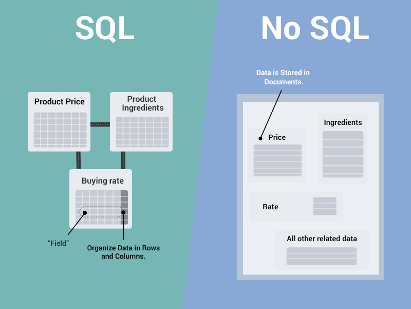

# SQL vs NoSQL

## SQL

* SQL은 '구조화 된 쿼리 언어 \(Structured Query Language\)'의 약자이다.
* 특정 유형의 데이터베이스와 상호 작용하는 데 사용 하는 쿼리 언어이다.
* SQL을 사용하면 관계형 데이터베이스 관리 시스템\(RDBMS\)에서 데이터를 저장, 수정, 삭제 및 검색 할 수 있다.

## RDBMS 특징

* 데이터는 정해진\(엄격한\) 데이터 스키마 \(= structure\)를 따라 데이터베이스 테이블에 저장된다.
* 데이터는 관계를 통해서 연결된 여러개의 테이블에 분산된다.

### 엄격한 스키마

* 데이터는 테이블에 레코드로 저장되며 각 테이블에는 명확하게 정의된 구조\(schema\)이 있다.
* 스키마를 준수하지 않는 레코드는 추가할 수 없다.

### 데이터 관계

* 정규화를 통해 데이터들을 여러개의 테이블에 나누어서, 데이터들의 중복을 피할 수 있다.

## NoSQL

* No SQL은 Non-SQL, Not Only SQL, non-relational database라고도 부른다. 의미는 SQL과 반대되는 접근방식으로 이해할 수 있다.
* RDB의 레코드는 문서\(documents\)로 일컫는다.
* 다른 구조의 데이터를 같은 컬렉션\(SQL의 테이블을 의미\)에 추가할 수 있다.

## 비교 분석

### 확장성

#### SQL

* SQL은 수식적으로 확장한다.
* 수직적 확장은 CPI나 RAM 같은 부품을 업그레이드하거나 하드웨어를 추가하여 서버의 성능을 향상시킨다.

#### NoSQL

* NoSQL은 수평적으로 확장한다.
* 수평적 확장은 더 많은 서버를 추가해서 서버를 전체적으로 분산시킨다.

### 관계

#### SQL

* 관계형 데이터는 각 table 간의 관계\(JOIN\)을 통해 데이터를 파악할 수 있다.
* 데이터 중복을 없앨 수 있고 데이터의 정확성을 높일 수 있다.

#### NoSQL

* 다른 Collection이 필요하다면 기존 Collection의 데이터를 일부 복제한다.
* Collection 별로 중복된 데이터가 존재한다.
* 중복된 데이터는 삭제하거나 업데이트할 때 반영이 되지 않을 수 있다.


Sharding\(샤딩\)은 같은 테이블 스키마를 가진 데이터를 다수의 DB에 분산하여 저장하는 방법이다. 이 기술을 접목하면 SQL도 수평적 확장을 적용할 수 는 있지만, 실제 구현은 어렵다고 한다.


### 속성

#### SQL

* SQL은 ACID 특성을 따른다.
* ACID는 DB의 트랜잭션이 안전하게 수행되는것을 보장하기 위한 특징이다.

#### NoSQL

* NoSQL은 CAP이론을 따른다.
* CAP이론은 분산 시스템에서는 CAP 세 가지 속성 모두를 만족하는 것은 불가능하며, 오직 2가지만 만족할 수 있다는 것으로 정의할 수 있다.


**CAP 이론**

* Consistency \(일관성\) : 모든 요청은 최신 데이터 또는 에러를 응답받는다. \(DB가 3개로 분산되었다고 가정할 때, 하나의 특정 DB의 데이터가 수정되면 나머지 2개의 DB에서도 수정된 데이터를 응답받아야 한다.\)
* Availability \(가용성\) : 모든 요청은 정상 응답을 받는다. \(특정 DB가 장애가 나도 서비스가 가능해야 한다.\)
*  Partitions Tolerance \(분리 내구성\) : DB간 통신이 실패하는 경우라도 시스템은 정상 동작 한다.


### 스키마

#### SQL

* SQL은 데이터를 저장하기 위해 스키마가 먼저 정의 되어야 한다.

#### NoSQL

* NoSQL은 JSON 혹은 객체의 형태인 Key-Value로 데이터가 저장된다. \(Document → Collection → Database\)

## 결론

### SQL

**장점**

* 스키마가 정의되어 있어 확실하고 명확하다.
* 구조의 완전성을 보장할 수 있다.
* 관계를 설정하기에, 데이터는 중복없이 한번만 저장된다.

**단점**

* 유연하지 못하다. 스키마를 사전에 시간 들여 철저하게 짜야 하고 나중에 수정하기 번거롭다 \(엄격한 스키마\).
* 관계를 맺어 데이터를 저장하기에, 중복되지는 않지만, 조인을 많이 해야할 경우 매우 복잡한 쿼리를 작성해야 할 수 있다.
* 수평적 확장이 가능하지만 어렵기 때문에 성장 한계가 오는 시점이 온다.

관계를 맺고 있는 데이터가 자주 변경되는 경우, 또 명확한 스키마가 사용자와 데이터에게 중요한 경우 관계형 데이터베이스를 사용하는게 좋다. 금융 산업과 같은 시스템의 형태가 급격하게 변하지 않으면서 그 안의 데이터가 계속 바뀌는 보수적인 시스템에서 유리하다.

### NoSQL

**장점**

* 스키마가 없기에, 훨씬 더 유연하다. 언제든지 데이터를 추가할 수 있다 \(필드 추가\).
* 어떠한 형식으로도 데이터를 저장할 수 있기에, 필요한 대로 저장해 읽어오는 속도가 빨라진다.
* 수직 및 수평 확장 모두 가능해 데이터베이스가 애플리케이션에서 발생시키는 모든 읽기 / 쓰기 요청을 처리할 수 있다.

**단점**

* 유연성에 의해, 데이터 구조 결정을 계속 미룰 수 있다.
* 데이터를 중복되게 필요한 컬렉션 마다 저장할 수 있어, 필요한 컬렉션마다 돌면서 여러 개의 레코드를 다 업데이트해줘야 한다. 누락할 시, 데이터가 최신이 아닐 수 있다.
* 수정 시, 모든 컬렉션에서 다 수정해줘야 한다.

비관계형 데이터베이스는 정확한 데이터 구조를 알 수 없거나 변경 / 확장 될 수 있는 경우 \(수평적으로\), 읽기 처리는 많이 하지만, 데이터를 자주 변경하지 않는 경우 사용하면 유리하다.

## 참고

* [https://siyoon210.tistory.com/130](https://siyoon210.tistory.com/130)
* [https://academind.com/learn/web-dev/sql-vs-nosql/](https://academind.com/learn/web-dev/sql-vs-nosql/)
* [https://velog.io/@thms200/SQL-vs-NoSQL](https://velog.io/@thms200/SQL-vs-NoSQL)
* [https://velog.io/@rlcjf0014/Database-SQL-vs-NoSQL](https://velog.io/@rlcjf0014/Database-SQL-vs-NoSQL)

